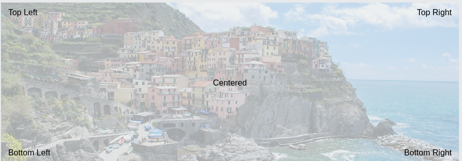

<!-- title -->
<h1 align="center">
    <span>positions</span>
    
</h1>

Todo elemento por padrão é `static`. Ou seja, não conseguimos movimentá-lo. Para mover esse elemento, precisamos setar ele com `position relative` or `position absolute` or `position fixed`.

Tipos de positions:

- `static` --> Todo elemento por padrão nasce static. Não conseguimos movimentá-lo. Não precisa declarar.

- `fixed` --> O elemento fica fixo na tela. Quando usamos o "scroll", o elemento fica fixo.
  
- `relative` --> Movimentamos o elemento em relação a posição atual.

- `absolute` --> Movimentamos o elemento respeitando seu pai. Esse pai precisa ter position relative.

Quando setamos a propriedade position para `relative` or `absolute` or `fixed`, desbloqueamos algumas properties:

- `top` --> Se afasta do topo tantos px.
- `right` --> Se afasta do lado direito tantos px.
- `bottom` --> Se afasta do bottom tantos px.
- `left` --> Se afasta do lado esquerdo tantos px.

⚠️ Não dá para usar as properties(top,right,bottom,left) se o position do element for `static`.

<br>

✏️ Crie uma `<div>` pai "container" e uma `<div>` filho "caixinha" para praticar. Manipule o filho e o coloque em todas as posicoes: <br>



<br>

⚠️ Quando colocamos position `absolute` em um elemento, ele vai se movimentar respeitando o pai mais próximo que tiver position `relative`. Se não tiver nenhum elemento pai com position `relative`, o elemento filho vai respeitar o elemento `body`. Isso porque o elemento `body` já vêm setado por padrão como position `relative`. Então... Sempre coloque o elemento pai com position `relative`.

```html
<body>
    <div class="container_pai">
        <div class="filho"></div>
    </div>
</body>
```

```css
body{
    display: flex;
    justify-content: center;
    
}

.container_pai{
    border: 2px solid tomato;
    height: 500px;
    width: 500px;
    position: relative; 
}

.filho{
    border: 2px solid purple;
    background-color: rgb(162, 72, 162);
    width: 200px;
    height: 200px;
    position: absolute;
    /* 
    posicionando no canto superior direito
    top: 0px;
    right: 0px;

    posicionando no canto inferior direito
    bottom: 0px;
    right: 0px;

    posicionando no canto inferior esquerdo
    left: 2px;
    bottom: 3px;

    posicionando no canto superior esquerdo
    top: 0px;
    left: 2px;
     */
}
```
Perceba que nós movimentamos o eixo x -> e o eixo y ^ . Por isso, usamos apenas 2 properties.

💡 É possível trabalhar com valores negativos também (top:-50px, bottom: -13px,etc..).
<hr>
<br>

## z-index
Quando um elemento fica em cima de outro elemento, qual vai ficar na frente?? Para resolver isso, vamos usar o `z-index: -1;`

Os elementos que não queremos que aparecam, vamos colocar `z-index: -1;`. Aí é só deixar o elemento que queremos que apareca sem declarar o `z-index: -1;`.

<br>

✏️ 

- Crie uma div pai "container" e 3 divs filhas "caixinha1", "caixinha2","caixinha3".
- Deixe cada caixinha de uma cor diferente, para facilitar a visualização.
- Coloque elas na mesma posição.
- Coloque uma de cada vez na frente.

```html
<body>
    <div class="container_pai">
        <div class="caixinha1"></div>
        <div class="caixinha2"></div>
        <div class="caixinha3"></div>
    </div>
</body>
```

```css
*{
    /* Removendo a margin e o padding que vêm por padrão */
    margin: 0;
    padding: 0;
}

.container_pai{
    border: 2px solid tomato;
    width: 400px;
    height: 400px;
    display: flex;
    flex-direction: row;
    position: relative;
}

.caixinha1{
    width: 100px;
    height: 100px;
    border: 2px solid black;
    background-color: #b16527;
    position: absolute;
    top: 2px;
    right: 2px;
    z-index: -1; /* Não vai aparecer */
    
}

.caixinha2{
    width: 100px;
    height: 100px;
    border: 2px solid black;
    background-color: #27b18a;
    position: absolute;
    top: 2px;
    right: 2px;
    /* Essa é a caixinha que vai aparecer */
}

.caixinha3{
    width: 100px;
    height: 100px;
    border: 2px solid black;
    background-color: #b1278e;
    position: absolute;
    top: 2px;
    right: 2px;
    z-index: -1; /* Não vai aparecer */
}
```

<br>

💡 O z-index é bom quando queremos esconder algum elemento. Imagine várias imagens no mesmo lugar/posicao. Você pode esconder todas elas com o `z-index="-1"` e deixar apenas 1 das imagens aparecendo. Sacou? Imagina as possibilidades, utilizando JavaScript.

O maior valor é o que vai aparecer. Exemplo:

``` css
.caixinha1{ z-index: 2; }

.caixinha2{ z-index: 30; } /* Essa é a caixinha que vai aparecer */

.caixinha3{ z-index: 2; }
```
  

<br>
<br>

<!-- Next page button-->
[](../4.flexbox/flexbox.md)