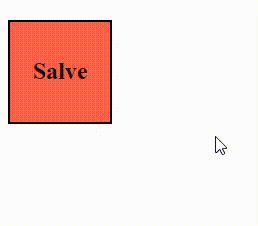

<h1 align="center">
    <span>Transition - efeito de transicao</span>
    
</h1>

Imagina um elemento h2 com um `background-color red`; Ao dar hover nesse elemento, a cor de fundo muda para azul. O transition vai setar o tempo de demora dessa alteração, sacou?


<br>

<div class="gifContainer" style="width:100%; height:300px; display:flex; flex-direction:row; justify-content:center;"> 

<div class="campo">


</div>


</div>

<br>
<br>


## Transition com CSS
✏️ Crie um elemento e mude o background-color ao dar hover.


```html
<body>
    <h2 class="title">
        <span>Salve</span>
    </h2>
</body>
```

```css
h2.title{
    background-color: tomato;
    border: 2px solid black;
    width: 200px;
    height: 200px;
    display: flex;
    flex-direction: row;
    justify-content: center;
    align-items: center;
    transition-duration: 1s;
}

h2.title:hover{
    background-color: aquamarine;
}
```

<hr>
<br>

## Transition com JS

```css
h2.elementoComHover{
    width: 150px;
    height: 150px;
    background-color: green;
}
```

```js
//function para adicionar nova cor
function mudarCor(elemento){
    elemento.classList.add("elementoComHover");
}

//function para voltar a cor inicial
function voltarCor(elemento){
    elemento.classList.remove("elementoComHover");
}

//selecionamos o elemento
const h2 = document.querySelector("h2.title");

//mouse em cima
h2.addEventListener("mouseover", function(){
    mudarCor(h2);
});

//mouse fora
h2.addEventListener("mouseout", function(){
    voltarCor(h2);
});
```

<hr>
<br>


<!-- Next page button-->
[](..)
